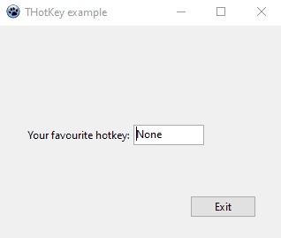

HotKey
======
Re-creating Delphi's THotKey component for the Lazarus Component Library. 

Use this component to create key combinations that can be used as a shortcut. This class provides properties to read and write a key combination at design and runtime, invalidate specific modifiers and define a text to display to the user for no set value.

To change the key combination at run time hold down the SHIFT, CTRL, or ALT key or combinations thereof and type a letter or number. 

